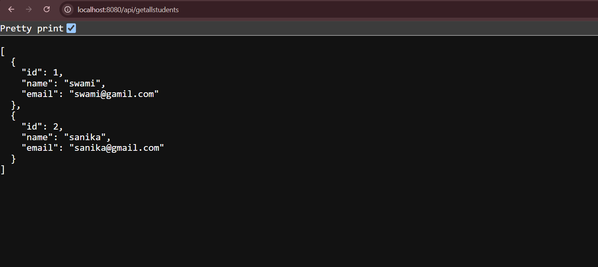
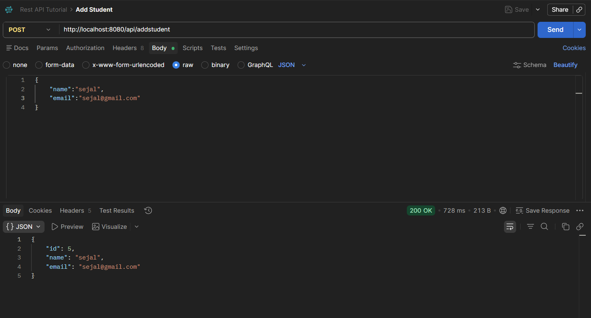
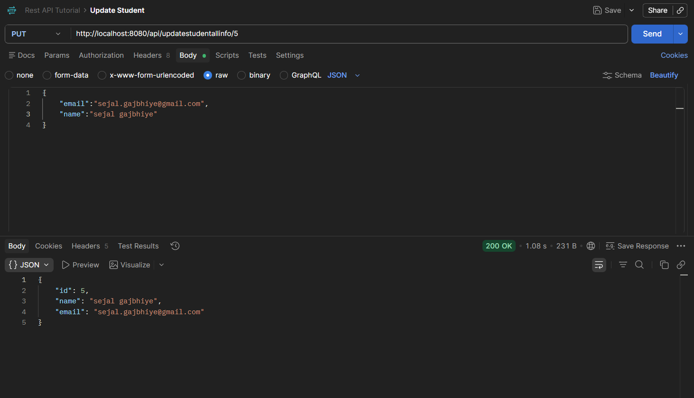
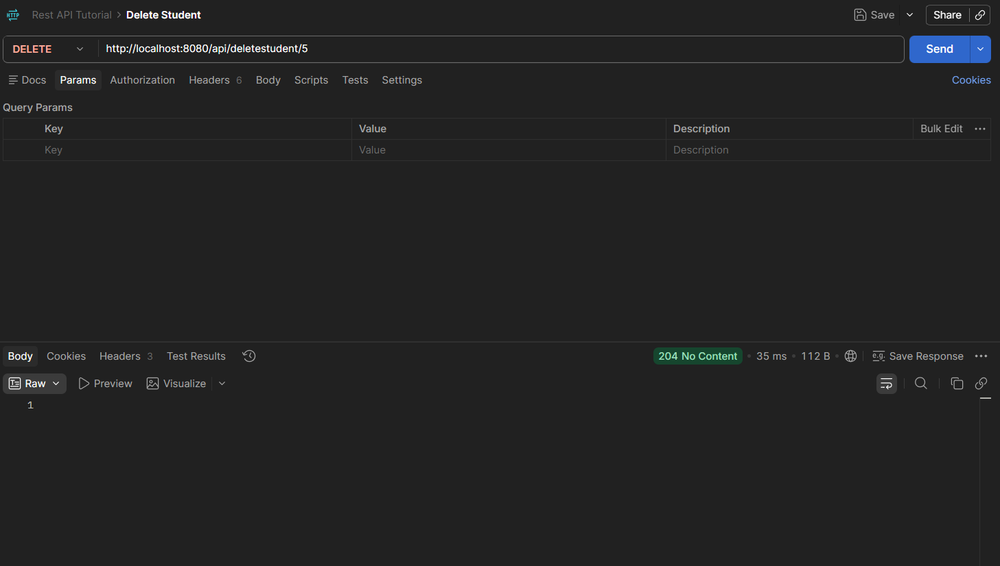

# Student Management System

A RESTful Student Management System developed using **Java and Spring Boot**. The application provides APIs to create, retrieve, update, partially update, and delete student records.

The project follows a layered architecture with separate **Controller, Service, Repository, Entity, and DTO** layers.

## 🚀 Features

* Add a new student
* Retrieve all students
* Retrieve a student by ID
* Delete a student by ID
* Update complete student information
* Partially update student information
* DTO-based request and response handling
* Entity-to-DTO mapping using ModelMapper
* Input validation using Jakarta Validation
* Service layer for business logic
* Repository layer using Spring Data JPA
* RESTful API development
* HTTP status handling using `ResponseEntity`

## 🛠️ Tech Stack

### Backend

* Java
* Spring Boot
* Spring Web
* Spring Data JPA
* Hibernate
* ModelMapper
* Jakarta Validation
* Lombok
* Maven

### Database

* PostgreSQL

### Tools

* IntelliJ IDEA
* Postman
* Git
* GitHub

## 🏗️ Architecture

The project follows a layered architecture:

```text
Client / Postman
       ↓
Controller Layer
       ↓
Service Layer
       ↓
Repository Layer
       ↓
PostgreSQL Database
```

### Main Layers

**Controller**

* Handles HTTP requests and responses.
* Defines REST API endpoints.

**Service**

* Contains the application's business logic.
* Handles student-related operations.

**Repository**

* Communicates with the database using Spring Data JPA.

**Entity**

* Represents the student table in the database.

**DTO**

* Used to transfer data between the client and application.
* Separates API data from database entities.

**ModelMapper**

* Maps between `StudentEntity` and DTO classes.

## 📁 Project Structure

```text
src
└── main
    ├── java
    │   └── com.springboot.Video4_a
    │       ├── controller
    │       │   └── StudentController.java
    │       │
    │       ├── dto
    │       │   ├── StudentDto.java
    │       │   └── StudentRequestDto.java
    │       │
    │       ├── entity
    │       │   └── StudentEntity.java
    │       │
    │       ├── repository
    │       │   └── StudentRepository.java
    │       │
    │       └── service
    │           ├── StudentService.java
    │           └── impl
    │               └── StudentServiceImpl.java
    │
    └── resources
        └── application.properties

pom.xml
README.md
.gitignore
```

## 📌 API Endpoints

### 1. Get All Students

**GET**

```text
/getallstudents
```

Returns all students available in the database.

Example:

```text
GET http://localhost:8080/getallstudents
```

---

### 2. Get Student By ID

**GET**

```text
/getbyid/{id}
```

Example:

```text
GET http://localhost:8080/getbyid/1
```

Returns the student corresponding to the provided ID.

---

### 3. Add Student

**POST**

```text
/addstudent
```

Example:

```text
POST http://localhost:8080/addstudent
```

Request body depends on the fields defined in `StudentRequestDto`.

Example:

```json
{
  "name": "Sejal",
  "email": "sejal@gmail.com"
}
```

The request is validated using Jakarta Validation before being processed.

---

### 4. Delete Student

**DELETE**

```text
/deletestudent/{id}
```

Example:

```text
DELETE http://localhost:8080/deletestudent/1
```

Deletes the student with the specified ID.

The API returns:

```text
204 No Content
```

after successful deletion.

---

### 5. Update Complete Student Information

**PUT**

```text
/updatestudentallinfo/{id}
```

Example:

```text
PUT http://localhost:8080/updatestudentallinfo/1
```

Updates the complete student information for the specified ID.

Request body:

```json
{
  "name": "Sejal",
  "email": "sejal@gmail.com"
}
```

The request is validated using Jakarta Validation.

---

### 6. Partially Update Student

**PATCH**

```text
/updatepartialstudent/{id}
```

Example:

```text
PATCH http://localhost:8080/updatepartialstudent/1
```

Allows specific student fields to be updated without sending the complete student object.

Example request:

```json
{
  "email": "newemail@gmail.com"
}
```

The application receives the updates as a `Map<String, Object>` and processes the requested changes through the service layer.

## 🔄 DTO Mapping

The project uses **ModelMapper** to convert between entities and DTOs.

```text
StudentEntity
      ↕
 ModelMapper
      ↕
StudentDto
```

This approach prevents the API layer from directly exposing the database entity.

## ✅ Validation

The project uses **Jakarta Validation** for validating incoming student data.

The `StudentRequestDto` is validated using:

```java
@Valid
```

before the request reaches the service layer.

## 🗄️ Database

The application uses **PostgreSQL** for persistent storage.

Database configuration is provided through:

```text
src/main/resources/application.properties
```

Example:

```properties
spring.datasource.url=jdbc:postgresql://localhost:5432/student_management
spring.datasource.username=YOUR_USERNAME
spring.datasource.password=YOUR_PASSWORD

spring.jpa.hibernate.ddl-auto=update
spring.jpa.show-sql=true
```

> Never commit your actual database password or other sensitive credentials to GitHub.

## ▶️ How to Run

### Prerequisites

Install the following:

* Java
* Maven
* PostgreSQL
* Git

### 1. Clone the repository

```bash
git clone https://github.com/sejalgajbhiye-ui/SpringBoot-Student-Management.git
```

### 2. Navigate to the project

```bash
cd SpringBoot-Student-Management
```

### 3. Create the PostgreSQL database

```sql
CREATE DATABASE student_management;
```

### 4. Configure database credentials

Update your local `application.properties` with your PostgreSQL username and password.

### 5. Run the application

Using Maven:

```bash
mvn spring-boot:run
```

Or run the main Spring Boot application class from IntelliJ IDEA.

The application will start at:

```text
http://localhost:8080
```

## 🧪 API Testing

The APIs can be tested using **Postman**.

## 📸 API Screenshots

### Get All Students



### Add Student



### Update Student



### Delete Student



## 📚 Concepts Implemented

This project demonstrates practical implementation of:

* Spring Boot
* REST APIs
* Dependency Injection
* Constructor-based dependency injection
* Spring Data JPA
* Hibernate
* PostgreSQL
* DTO pattern
* ModelMapper
* Layered architecture
* CRUD operations
* PUT vs PATCH
* Request validation
* HTTP status codes
* `ResponseEntity`
* Maven
* Git and GitHub

## 👩‍💻 Author

**Sejal Gajbhiye**

GitHub:

https://github.com/sejalgajbhiye-ui
